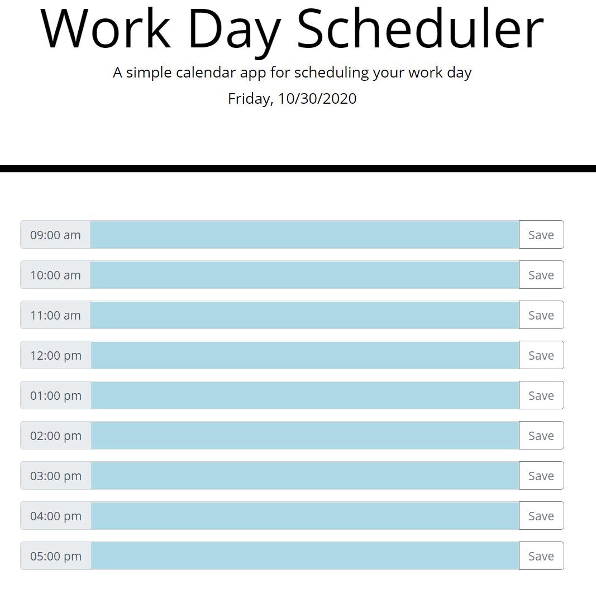
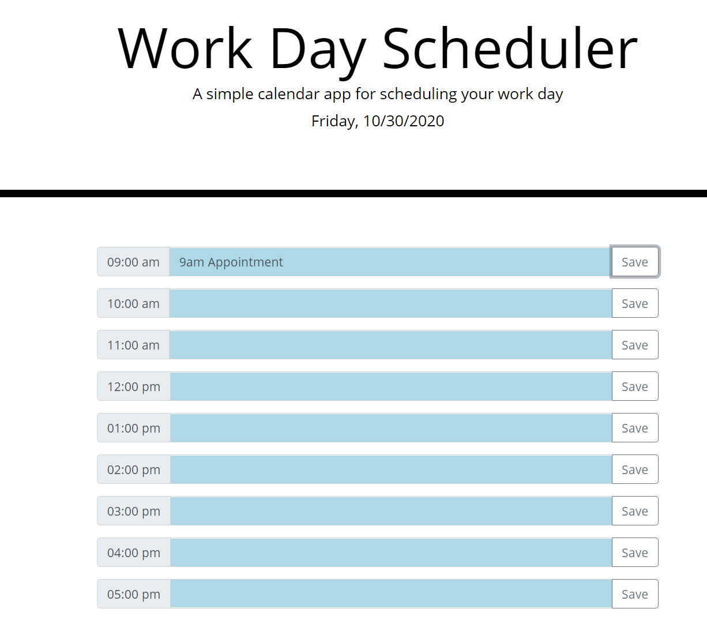
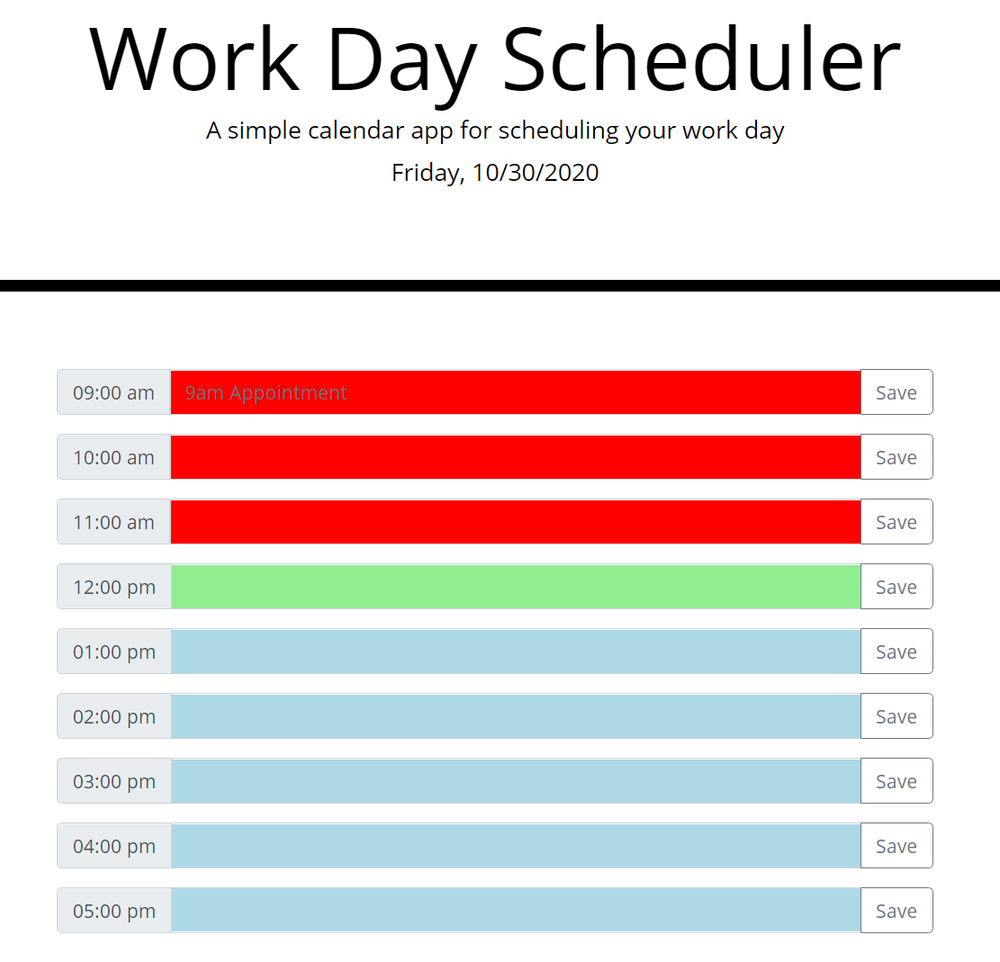
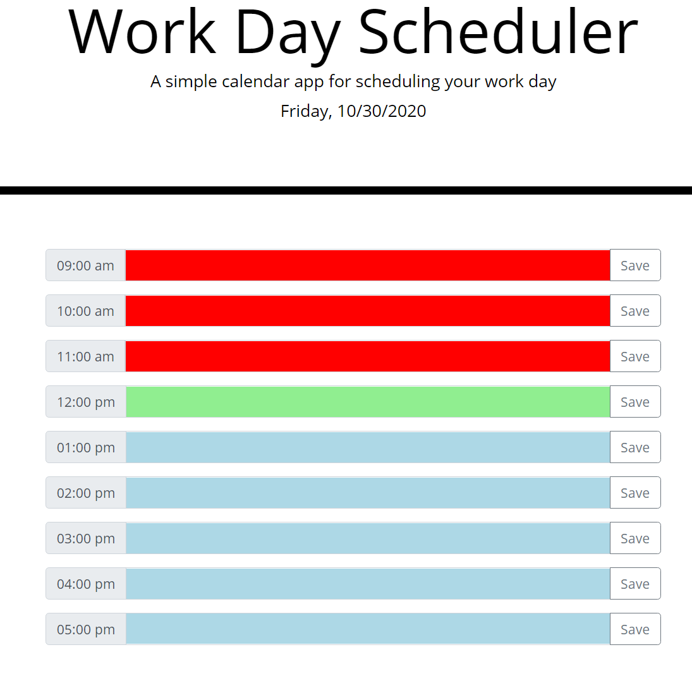

# Calendar Application

## About The Repository

### Summary

This repository contains a calendar app powered by Javascript, jQuery, and moment.js. This quiz utilizes these technologies to:

- Display the current date and time.
- Display current work hours and appointments.
- Allows the user to save appointments in localStorage.
- Allows the user to change appointments.
- Color codes the hour times so the user knows if the hours is in the past (red), current hour (light green), or future (light blue).

### Calendar Functionality

Enter your appointments in the appropriate time slot and when you're ready to save it to memory click save. When you refresh the page your appointment will display in the timeslot you saved it to. If you want to remove and appointment click save without making any edits to the timeslot and a blank entry will be saved to localStorage.

## Website Mock

Website URL: https://jrkrichards.github.io/Scheduler/

### Calendar:

Start:

Appointment Saved:

Colored Hours:

Cleared Appointment:

